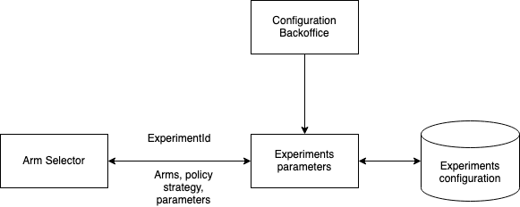

# experiments-params

- Retrieves experiment data from Configuration Data base.



## How to run

### Start sql container and run queries located in db_schema / creation_schema.sql

```
docker run --name db \
    -e MYSQL_ROOT_PASSWORD=testroot \
    -e MYSQL_USER=jackpotian \
    -e MYSQL_PASSWORD=test \
    -e MYSQL_DATABASE=experiment_db \
    -p 3307:3306 \
    -d mysql:8.0
```

### Set the following env variables or ask for the .env file

```
DB_HOST=localhost
DB_PORT=3307
DB_USER=jackpotian
DB_PASSWORD=test
DB_NAME=experiment_db
```

### Build and run
```
go build
go run .
```

## Explore

```
http://localhost:8091/swagger/index.html
```

## Update swagger

```
swag init
```

## Build Docker image

```
docker build -t experiment-params .
docker run -p 8091:8091 experiment-params
```
